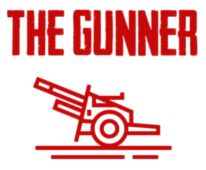
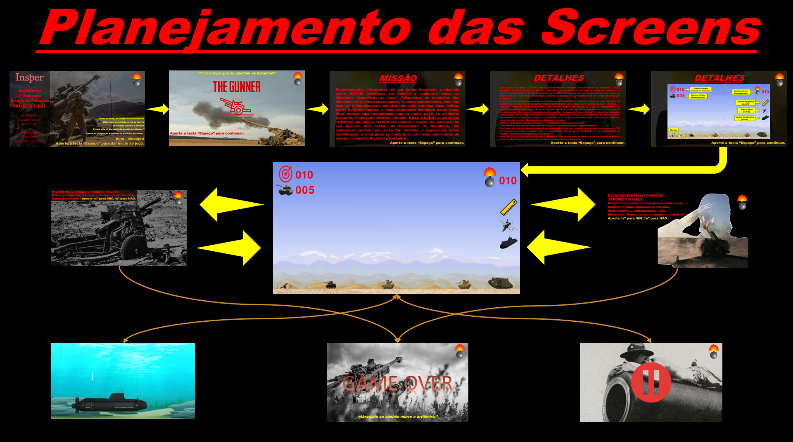

## INSPER - Engenharia - 1º Semestre - Design de Software - Projeto Final
### Membros: *Augusto Giuliani e Natan Lewi.*
### Orientadores: *Fillipe Resina e Humberto Sandmann.*
---
# *The Gunner*
Logo do jogo:

Link com o vídeo mostrando o jogo: https://youtu.be/wKD6xLcEQXo

Planejamento das telas/screens do jogo:

### **Descrição: Um jogo de artilharia. O usuário será um sargento, que está sob o comando de uma peça de artilharia (no caso do jogo, um obuseiro). Seu objetivo é abater alvos inimigos que fazem parte de um movimento terrorista. O usuário poderá alterar a carga de projeção (que determina a velocidade do projétil/granada), acionar suportes que estão a sua disposição, dar pausa no jogo e receberá um feedback sobre a sua performance, em caso de vitória. Para jogar, rode o arquivo THE_GUNNER.py.**